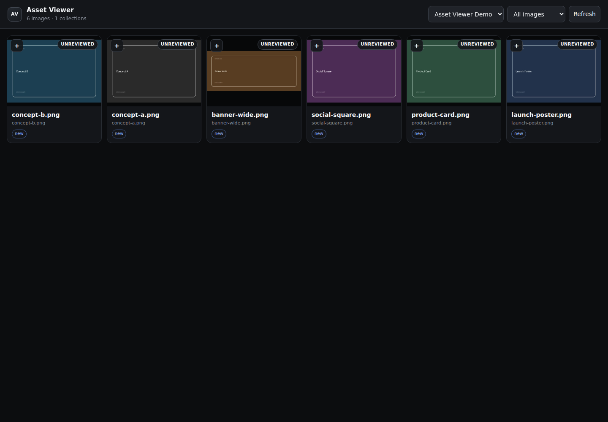

# Asset Viewer

[](https://github.com/TheSpyglassofOdysseus/asset-viewer/actions/workflows/ci.yml) [](LICENSE) [](https://www.python.org/)

> A local-first visual review gallery for AI-generated images and project asset folders.

Asset Viewer gives humans a clean place to **see, compare, approve, defer, and reject image assets without moving the originals**.

It was built for a simple workflow problem: agents and creative tools are increasingly good at producing images, but the review step often degenerates into oversized chat attachments, IDE file trees, temporary uploads, or copies scattered across cloud drives. Asset Viewer keeps review separate from storage.



## Why it exists

A good image pipeline should be boring:

1. A tool or agent writes images to the project folder that owns them.
2. That folder is registered with Asset Viewer once.
3. A human opens one stable gallery URL and reviews the work.
4. Approval state lives beside the workflow, not inside the original files.

No import job. No duplicate asset library. No requirement to upload the batch to a chat window just to inspect it.

## Features

- **Register existing folders in place** — originals never need to move.
- **Fast thumbnail grid** with lazy loading and disk-cached previews.
- **Full-screen carousel** for image-by-image review.
- **Approve / Maybe / Reject** states stored separately from source files.
- **Keyboard review**: arrow keys to navigate; `A`, `M`, `R` to classify.
- **Multiple collections** behind one viewer URL.
- **Recursive discovery** of PNG, JPEG, WebP, GIF, AVIF, BMP, and SVG assets.
- **Local-first security posture** — binds to `127.0.0.1` by default.
- **Agent-friendly CLI** that is easy to call from scripts and repo instructions.
- **Minimal stack** — Python, Pillow, SQLite from the standard library, and a small browser UI. No external database service required.

## Quick start

Asset Viewer requires Python 3.10+. The easiest install from GitHub is with `pipx`:

```bash
pipx install git+https://github.com/TheSpyglassofOdysseus/asset-viewer.git
asset-viewer demo
asset-viewer serve
```

Or install from a clone for development:

```bash
# From a clone
python -m venv .venv
source .venv/bin/activate
pip install -e .

# Register a real image folder
asset-viewer add /absolute/path/to/project/images "Project Images"

# Start the viewer
asset-viewer serve
```

Open `http://127.0.0.1:8160`.

Want to try it without your own images?

```bash
asset-viewer demo
asset-viewer serve
```

The demo command creates a small set of synthetic sample assets and registers them as a collection.

## CLI

```text
asset-viewer add PATH [LABEL]      Register an image folder
asset-viewer remove SLUG|PATH      Remove a collection
asset-viewer list                  List registered folders
asset-viewer scan [--collection]   Discover/refresh asset metadata
asset-viewer reviews --collection  Read review state (add --json for agents)
asset-viewer export-manifest       Export review state as JSON
asset-viewer doctor                Check state and deployment prerequisites
asset-viewer serve                 Start the web viewer
asset-viewer demo                  Create/register synthetic demo assets
```

Common server usage:

```bash
asset-viewer add /srv/renders/acme "Acme Renders"
asset-viewer add /home/me/project/output "Project Output"
asset-viewer list
asset-viewer serve --host 127.0.0.1 --port 8160
```

## Designed for agents

Asset Viewer is intentionally easy to make part of an agent contract. Put something like this in `AGENTS.md`, `CLAUDE.md`, or your automation instructions:

```md
## Image review

When this repository creates images for human review:

1. Keep originals in the project-owned output folder.
2. Register that folder with:
   `asset-viewer add /absolute/path/to/images "Friendly Name"`
3. Tell the human the new assets are available in Asset Viewer.
4. Do not upload full-resolution batches to chat merely for review.
```

That turns the handoff into a predictable sentence: **“I added the new images to Asset Viewer.”**

See [docs/AGENT_WORKFLOW.md](docs/AGENT_WORKFLOW.md) for a fuller pattern.

## Data model

Asset Viewer does not ingest or copy your originals.

By default it stores only:

```text
~/.local/share/asset-viewer/
├── collections.json    # registered source folders
└── asset-viewer.db     # transactional review state, notes, seen/new state

~/.cache/asset-viewer/
└── *.jpg               # generated thumbnails
```

Override the data locations with `ASSET_VIEWER_HOME` and `ASSET_VIEWER_CACHE`.

Deleting Asset Viewer does not delete your project images.

## Remote access and security

Asset Viewer binds to localhost by default. For remote/private deployments it also supports optional HTTP Basic authentication with `ASSET_VIEWER_PASSWORD`, but an authenticated reverse proxy/private network remains the preferred outer boundary.

For remote use, keep the application on `127.0.0.1` and put it behind an authenticated/private reverse proxy such as Tailscale Serve, Caddy with authentication, nginx behind your VPN, or an equivalent trusted access layer. Reverse-proxy deployments must explicitly allow the browser-facing hostname, for example:

```bash
ASSET_VIEWER_PASSWORD='use-a-secret-manager' asset-viewer serve --host 127.0.0.1 --trusted-host gallery.example.com
```

Non-loopback binds are rejected unless at least one `--trusted-host` is supplied. Do not expose the raw listener directly to the public internet unless you have added an appropriate authentication boundary in front of it.

See [docs/DEPLOYMENT.md](docs/DEPLOYMENT.md), [SECURITY.md](SECURITY.md), and the [2026-09-13 security audit](docs/SECURITY_AUDIT_2026-09-13.md).

## Project philosophy

Asset Viewer is deliberately not a DAM, cloud sync service, image editor, or source-of-truth database. Those products solve different problems.

The job here is narrower:

> **Make image review a first-class, stable interface while leaving storage ownership where it already belongs.**

That separation is especially useful for generative workflows, where image volume can be high and most variants are temporary.

## Development

```bash
git clone https://github.com/TheSpyglassofOdysseus/asset-viewer.git
cd asset-viewer
python -m venv .venv
source .venv/bin/activate
pip install -e .
python -m unittest discover -v
```

Run a development instance with isolated state:

```bash
export ASSET_VIEWER_HOME="$PWD/.dev-data"
export ASSET_VIEWER_CACHE="$PWD/.dev-cache"
asset-viewer demo --path "$PWD/.demo-assets"
asset-viewer serve --port 8160
```

## Roadmap

The roadmap is organized around a deliberate progression: **production hardening → human/agent feedback → agent-native automation → serious creative review → collaboration**.

The highest-value product step after hardening is a machine-readable review manifest: humans should be able to approve, reject, or comment visually, and agents should be able to consume that decision without scraping the UI or parsing a chat transcript.

See [docs/ROADMAP.md](docs/ROADMAP.md) for the phased feature/benefit analysis and roadmap.

Issues and focused pull requests are welcome. See [CONTRIBUTING.md](CONTRIBUTING.md).

## License

MIT. See [LICENSE](LICENSE).
