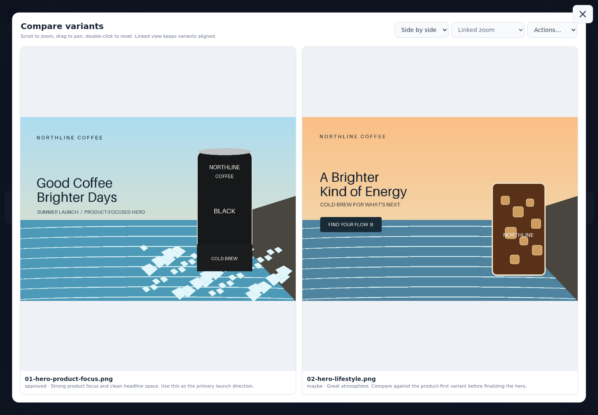
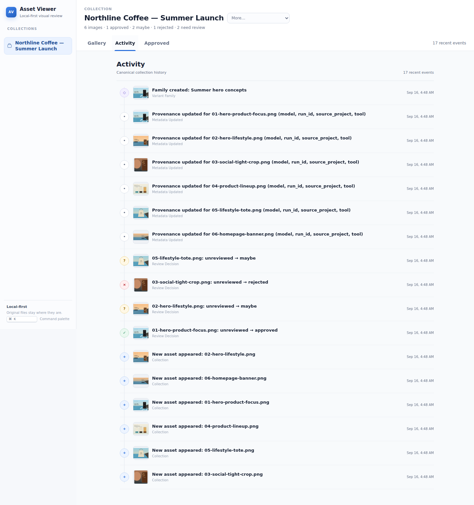
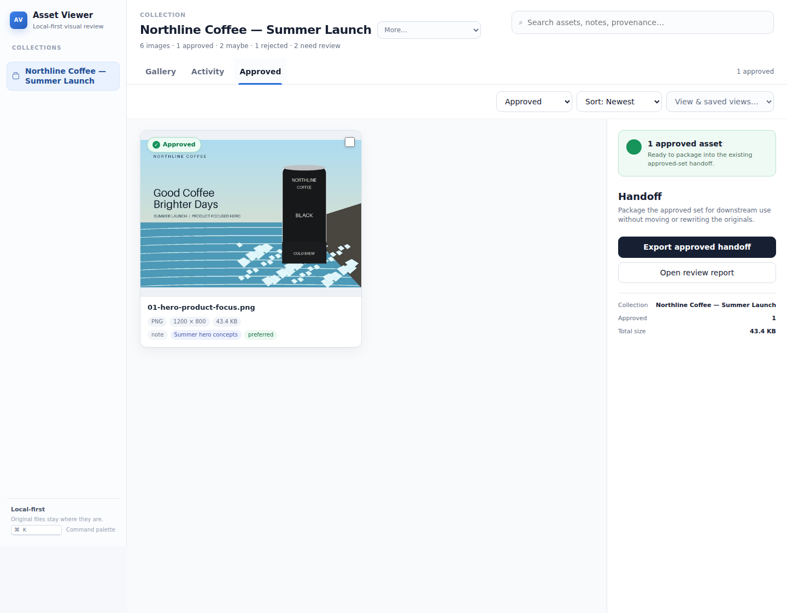

# Asset Viewer

[](https://github.com/TheSpyglassofOdysseus/asset-viewer/actions/workflows/ci.yml) [](LICENSE) [](https://www.python.org/)

> A local-first visual review gallery for AI-generated images and project asset folders.

Asset Viewer gives humans a clean place to **see, compare, approve, defer, and reject image assets without moving the originals**.

It was built for a simple workflow problem: agents and creative tools are increasingly good at producing images, but the review step often degenerates into oversized chat attachments, IDE file trees, temporary uploads, or copies scattered across cloud drives. Asset Viewer keeps review separate from storage.

### Review the work, not the file tree

Open a collection and the review state is immediately visible: what needs attention, what is approved, what is rejected, and which assets belong to the same variant family. The original project folders stay exactly where they are.


*Actual Asset Viewer UI. The built-in demo seeds a fictional Northline Coffee campaign so the complete workflow is visible immediately after install.*

### Compare variants where the pixels matter

Group related generations into a variant family and inspect them side by side with linked zoom/pan, overlay, or difference views. Review notes and preferred-variant state remain attached to the exact assets instead of disappearing into a chat transcript.



### Follow the decision trail, then hand off the approved set

Activity is a human-readable projection of the same durable event stream automation consumes. The Approved workspace is a focused lens over canonical review state, with the existing integrity-checked handoff and review report ready for downstream use.

<table>
<tr>
<td width="50%"></td>
<td width="50%"></td>
</tr>
<tr>
<td><em>Real collection activity and review decisions.</em></td>
<td><em>Real approved assets and existing handoff controls.</em></td>
</tr>
</table>

The demo includes a product-first hero, a lifestyle alternative, an intentionally bad crop, a product lineup, a lifestyle concept, and a homepage banner. It arrives with a few example decisions and two assets still waiting for review, so a new user can exercise the real review loop instead of staring at placeholder rectangles.

## Why it exists

A good image pipeline should be boring:

1. A tool or agent writes images to the project folder that owns them.
2. That folder is registered with Asset Viewer once.
3. A human opens one stable gallery URL and reviews the work.
4. Approval state lives beside the workflow, not inside the original files.

No import job. No duplicate asset library. No requirement to upload the batch to a chat window just to inspect it.

## Features

- **Register existing folders in place** — originals never need to move.
- **Fast thumbnail grid** with lazy loading and disk-cached previews.
- **Full-screen carousel** using bounded review-size previews; full-resolution originals load only on explicit request.
- **Approve / Maybe / Reject** states stored separately from source files.
- **Review notes/comments plus pinned point/region annotations** attached to the exact asset without modifying it; spatial feedback is content-fingerprinted and becomes stale if the underlying pixels change.
- **New/unseen tracking** so recurring collections show what changed.
- **Variant/version families** that group related attempts without moving or renaming originals, with preferred/latest semantics and one-click family comparison.
- **Batch review plus side-by-side / overlay / difference comparison** with linked or independent zoom/pan for precise variant triage.
- **Stable collection and asset deep links** for direct handoff to a gallery or exact image.
- **Machine-readable manifests and ordered event feeds** through the CLI and read-only JSON API.
- **Explicit review completion** with automation-friendly pending state.
- **Review history and undo** for status/comment decisions.
- **Stable asset IDs, SHA-256 review fingerprints, and durable cataloging** so review state survives renames while replacements/deletions invalidate stale completion safely.
- **Metadata-aware search and sorting** across filenames, paths, notes, family names, and optional provenance fields such as project/model/prompt/run ID.
- **Human-readable Activity view** backed by the same durable event stream agents consume.
- **Approved-set handoff manifests** with exact stable IDs, hashes, decisions, annotations, family/preferred state, and provenance; optional copying is explicit and never mutates originals.
- **Grouped collection navigation** that organizes the viewer without moving project folders.
- **Project-native `.asset-viewer.toml` registration** so repositories can declare review folders without bespoke setup scripts.
- **Metadata adapters** for sidecar JSON and isolated PNG generation metadata import.
- **Durable outbound webhooks** with signed delivery, replay control, and per-endpoint cursors for push automation.
- **Context-aware selectors and menus** so capabilities grow without turning the toolbar into a button farm.
- **Keyboard review**: arrow keys to navigate; `A`, `M`, `R` to classify.
- **Multiple collections** behind one viewer URL.
- **Recursive discovery** of PNG, JPEG, WebP, GIF, AVIF, BMP, and SVG assets.
- **Local-first security posture** — localhost by default, Waitress production serving, CSRF/Host enforcement, safe SVG handling, process-isolated bounded decoding, and optional Basic auth.
- **Agent-friendly CLI** that is easy to call from scripts and repo instructions.
- **Minimal stack** — Python, Pillow, Waitress, SQLite from the standard library, and a small browser UI. No external database service required.

## Quick start

Asset Viewer requires Python 3.10+. The easiest install from GitHub is with `pipx`:

```bash
pipx install git+https://github.com/TheSpyglassofOdysseus/asset-viewer.git
asset-viewer demo
asset-viewer serve
```

Or install from a clone for development:

```bash
# From a clone
python -m venv .venv
source .venv/bin/activate
pip install -e .

# Register a real image folder
asset-viewer add /absolute/path/to/project/images "Project Images"

# Start the viewer
asset-viewer serve
```

Open `http://127.0.0.1:8160`.

Want to try it without your own images?

```bash
asset-viewer demo
asset-viewer serve
```

The demo command creates a small set of synthetic sample assets and registers them as a collection.

### Live updates and reports

`asset-viewer serve` watches registered folders by default. Filesystem events trigger the normal bounded reconciliation path, while periodic full reconciliation remains the correctness fallback. Use `--no-watch` to disable it or `asset-viewer watch` to run watching separately.

The collection **Actions** menu opens a printable review summary for the active collection. The same report is available from the CLI:

```bash
asset-viewer report --collection project-images --output review.html
asset-viewer report --collection project-images --format markdown --output review.md
```

### Project-native registration and metadata

A repository can declare its review surfaces in a project-owned `.asset-viewer.toml`:

```toml
version = 1
project = "Example Project"
group = "Design"

[[collections]]
path = "artifacts/renders"
label = "Generated Renders"
adapters = ["sidecar", "png_text"]
```

Then validate or register it without duplicating source files:

```bash
asset-viewer project-sync --dry-run
asset-viewer project-sync
```

Sidecar metadata uses `<image>.asset-viewer.json`; supported PNG text metadata is parsed in the same isolated worker boundary used for image inspection.

### Push review events with webhooks

The durable event feed can be delivered to an operator-configured HTTP(S) endpoint. First use starts at the current event cursor unless `--replay` is requested. Add `--secret` to sign the request body with `X-Asset-Viewer-Signature`.

```bash
asset-viewer webhook --url https://example.invalid/review-events --once
asset-viewer webhook-status
```

### Optional MCP adapter

Install the optional MCP dependency and run the adapter over stdio:

```bash
pipx inject local-asset-viewer 'mcp>=2,<3'
asset-viewer mcp
```

The MCP layer reuses the existing review protocol; it does not create a second database or review state. It exposes collection state, reviews, completion/pending state, ordered events, annotations, variant families, stable browser URLs, and explicit refresh tools.

## CLI

```text
asset-viewer add PATH [LABEL]      Register an image folder (`--group` optionally groups navigation)
asset-viewer remove SLUG|PATH      Remove a collection
asset-viewer list                  List registered folders
asset-viewer capabilities --json   Describe the stable agent/API contract
asset-viewer scan [--collection]   Discover/refresh asset metadata
asset-viewer reviews [--collection]  Read review state (add --json for agents)
asset-viewer export-manifest       Export review state as JSON
asset-viewer pending                Exit 2 while human review is still pending
asset-viewer events                 Read ordered review events for automation
asset-viewer webhook ...              Push ordered review events with a durable cursor
asset-viewer webhook-status           Inspect sanitized webhook delivery state
asset-viewer wait-for-review        Wait on the explicit human-completion gate
asset-viewer complete SLUG          Mark a fully-reviewed collection complete
asset-viewer reopen SLUG            Reopen collection review
asset-viewer history SLUG REL       Show review history for one asset
asset-viewer undo SLUG REL          Undo the latest review/comment change
asset-viewer collection-url SLUG    Print the stable collection handoff URL
asset-viewer asset-url SLUG ASSET   Print a stable deep link to one asset
asset-viewer families SLUG           List variant/version families
asset-viewer family-create ...        Group related assets without moving them
asset-viewer family-add/remove ...    Maintain family membership
asset-viewer family-prefer ...        Set/clear the preferred family member
asset-viewer annotations SLUG ASSET List point/region feedback for one asset
asset-viewer annotate ...            Create precise point/region feedback
asset-viewer cache [status|prune]    Inspect/prune generated preview cache
asset-viewer report ...              Export a printable HTML/Markdown review report
asset-viewer project-config ...       Inspect the nearest project-owned config
asset-viewer project-sync ...         Register declared review folders/import metadata
asset-viewer metadata-import ...      Import sidecar/PNG generation metadata
asset-viewer metadata SLUG ASSET ... Read/update optional provenance metadata
asset-viewer activity ...            Read recent human-readable collection activity
asset-viewer handoff SLUG ...        Export the exact approved asset set
asset-viewer watch                   Watch registered folders and reconcile changes
asset-viewer mcp                     Run the optional MCP adapter for agents
asset-viewer annotation-update ...   Resolve/reopen/edit an annotation
asset-viewer annotation-delete ...   Delete an annotation
asset-viewer doctor                Check state and deployment prerequisites
asset-viewer serve                 Start the web viewer
asset-viewer demo                  Create/register synthetic demo assets
```

Common server usage:

```bash
asset-viewer add /srv/renders/acme "Acme Renders" --group "Client / Acme"
asset-viewer add /home/me/project/output "Project Output"
asset-viewer list
asset-viewer serve --host 127.0.0.1 --port 8160
```

## Designed for agents

Asset Viewer is intentionally easy to make part of an agent contract. Put something like this in `AGENTS.md`, `CLAUDE.md`, or your automation instructions:

```md
## Image review

When this repository creates images for human review:

1. Keep originals in the project-owned output folder.
2. Register that folder with:
   `asset-viewer add /absolute/path/to/images "Friendly Name"`
3. Tell the human the new assets are available in Asset Viewer.
4. Do not upload full-resolution batches to chat merely for review.
```

That turns the handoff into a predictable sentence: **“I added the new images to Asset Viewer.”**

Automation can now close the loop explicitly:

```bash
asset-viewer pending --collection project-images --json
# exit code 2 = human review still required
# exit code 0 = review explicitly completed

asset-viewer reviews --collection project-images --json
asset-viewer metadata project-images concept-17.png --set model=imagegen --set run_id=brand-007 --json
asset-viewer handoff project-images --output approved-handoff.json
asset-viewer events --collection project-images --after 0 --json
asset-viewer wait-for-review --collection project-images --timeout 900 --json
asset-viewer collection-url project-images --base-url https://viewer.example.com
asset-viewer asset-url project-images concept-17.png --base-url https://viewer.example.com
```

See [docs/AGENT_WORKFLOW.md](docs/AGENT_WORKFLOW.md) for a fuller pattern and [docs/API.md](docs/API.md) for the versioned machine-readable contract.

## Data model

Asset Viewer does not ingest or copy your originals.

By default it stores only:

```text
~/.local/share/asset-viewer/
├── collections.json    # registered source folders
└── asset-viewer.db     # transactional catalog, stable IDs, review/events state

~/.cache/asset-viewer/
└── *.jpg               # generated thumbnails
```

Override the data locations with `ASSET_VIEWER_HOME` and `ASSET_VIEWER_CACHE`.

Deleting Asset Viewer does not delete your project images.

## Remote access and security

Asset Viewer binds to localhost by default. For remote/private deployments it also supports optional HTTP Basic authentication with `ASSET_VIEWER_PASSWORD`, but an authenticated reverse proxy/private network remains the preferred outer boundary.

For remote use, keep the application on `127.0.0.1` and put it behind an authenticated/private reverse proxy such as Tailscale Serve, Caddy with authentication, nginx behind your VPN, or an equivalent trusted access layer. Reverse-proxy deployments must explicitly allow the browser-facing hostname, for example:

```bash
ASSET_VIEWER_PASSWORD='use-a-secret-manager' asset-viewer serve --host 127.0.0.1 --trusted-host gallery.example.com
```

`asset-viewer serve` now uses Waitress as its production serving layer. Direct non-loopback binds require both a trusted Host configuration and built-in authentication by default. `--allow-unauthenticated-remote` is an explicit escape hatch only for deployments where a trusted private/authenticated boundary already provides access control. Keep TLS and any broader identity/SSO policy at a trusted reverse proxy or private-network boundary.

See [docs/DEPLOYMENT.md](docs/DEPLOYMENT.md), [SECURITY.md](SECURITY.md), the security-audit series, and the [final public-release sign-off](docs/PUBLIC_RELEASE_SIGNOFF_2026-09-13.md). The feature audits record the competitive/product analysis behind the roadmap.

## Project philosophy

Asset Viewer is deliberately not a DAM, cloud sync service, image editor, or source-of-truth database. Those products solve different problems.

The job here is narrower:

> **Make image review a first-class, stable interface while leaving storage ownership where it already belongs.**

That separation is especially useful for generative workflows, where image volume can be high and most variants are temporary.

## Development

```bash
git clone https://github.com/TheSpyglassofOdysseus/asset-viewer.git
cd asset-viewer
python -m venv .venv
source .venv/bin/activate
pip install -e .
python -m unittest discover -v
```

Run a development instance with isolated state:

```bash
export ASSET_VIEWER_HOME="$PWD/.dev-data"
export ASSET_VIEWER_CACHE="$PWD/.dev-cache"
asset-viewer demo --path "$PWD/.demo-assets"
asset-viewer serve --port 8160
```

## Engineering documents

- [Agent/API contract](docs/API.md)
- [Feature and benefit analysis](docs/FEATURE_ANALYSIS.md)
- [v0.4 feature audit](docs/FEATURE_AUDIT_2026-09-13.md)
- [v0.5 feature and benefit audit](docs/FEATURE_AUDIT_2026-09-13_V05.md)
- [Initial security audit](docs/SECURITY_AUDIT_2026-09-13.md)
- [Round-two security audit](docs/SECURITY_AUDIT_2026-09-13_ROUND2.md)
- [Round-three production/precision-review security audit](docs/SECURITY_AUDIT_2026-09-13_ROUND3.md)
- [Final public-release sign-off](docs/PUBLIC_RELEASE_SIGNOFF_2026-09-13.md)
- [Round-two feature audit](docs/FEATURE_AUDIT_2026-09-13_ROUND2.md)
- [Deployment guide](docs/DEPLOYMENT.md)
- [Product roadmap](docs/ROADMAP.md)

## Roadmap

The roadmap is organized around a deliberate progression: **production hardening → human/agent feedback → agent-native automation → serious creative review → collaboration**.

The core human→agent loop now includes precise annotations, linked comparison, variant families, live watching, printable reports, provenance metadata, a human Activity view, exact approved-set handoff, grouped collection navigation, project-native registration/metadata adapters, saved-view and command-palette affordances, durable webhooks, and an optional MCP adapter. The next product frontier is stronger identity for collaborative deployments and signed release provenance while preserving the local-first review-plane boundary.

See [docs/ROADMAP.md](docs/ROADMAP.md) for the phased feature/benefit analysis and roadmap.

Issues and focused pull requests are welcome. See [CONTRIBUTING.md](CONTRIBUTING.md).

## Releases

Tagged releases publish a wheel, source archive, CycloneDX SBOM, and SHA-256 checksums. Release CI also runs the security and dependency checks described in the audit documentation.

## License

MIT. See [LICENSE](LICENSE).
